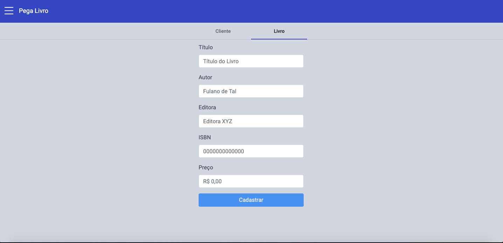

# pegalivro
Loja de Aluguel de Livros
Backend feito com spring boot e Postgres como banco de dados
Frontend em Desenvolvimento com Angular 9 

[![NPM Version][npm-image]][npm-url]
[![Build Status][travis-image]][travis-url]
[![Downloads Stats][npm-downloads]][npm-url]

O Backend se trata de uma API REST para gerenciamento de uma loja que aluga livros. Através da API a empresa poderá manter o cadastro dos livros, clientes, aluguéis. Será possivel acompanhar no Frontend um dashboard com os livros que estão sendo devolvidos e alugados em tempo real.

## Rodando o projeto

Foi feito deploy do Backend no Heroku, sendo possível acessar através da seguinte URL, "https://apirest-pegalivro.herokuapp.com/api", 
O cors está configurando para aceitar requisições de "http://localhost:4200", geralmente a porta 4200 é utilizada por aplicações angular.
Para Acessar a API, métodos GET, POST, PUT e DELETE :
livros: https://apirest-pegalivro.herokuapp.com/api/livros,
Clientes: https://apirest-pegalivro.herokuapp.com/api/clientes,
Pedidos: https://apirest-pegalivro.herokuapp.com/api/pedidos

Se preferir fazer download do projeto é necessário criar o database no banco de dados para que as tabelas sejam criadas, e assim poderá aceitar os registros.

## Desenvolvedor

Thiago Lima – [@thiagolimadev](https://twitter.com/thiagolimadev) – thiagolima2202@gmail.com

[npm-image]: https://img.shields.io/npm/v/datadog-metrics.svg?style=flat-square
[npm-url]: https://npmjs.org/package/datadog-metrics
[npm-downloads]: https://img.shields.io/npm/dm/datadog-metrics.svg?style=flat-square
[travis-image]: https://img.shields.io/travis/dbader/node-datadog-metrics/master.svg?style=flat-square
[travis-url]: https://travis-ci.org/dbader/node-datadog-metrics
[wiki]: https://github.com/thiagolima08/pegalivro/wiki
